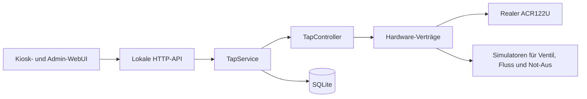

# Zunder Zapfe

[](https://github.com/nemai09/zunder_zapfe/actions/workflows/ci.yml)
[](LICENSE)

Zunder Zapfe ist eine offline betriebene, automatisierte Bierzapfanlage auf
Basis eines Raspberry Pi. Das Projekt verbindet einen NFC-Leser, einen
sicherheitsorientierten Zapfzustandsautomaten, lokale SQLite-Datenhaltung und
eine Weboberfläche für den Kioskbetrieb.

> **Alpha-Hinweis:** Die reale Ventil-, Durchfluss- und Not-Aus-Hardware ist
> noch nicht integriert oder sicherheitstechnisch abgenommen. Der aktuelle
> Stand darf kein echtes Ventil ohne eine fachgerechte elektrische
> Sicherheitskette steuern.

## Aktueller Stand

| Bereich | Status |
| --- | --- |
| ACR122U-NFC-Leser | Ereignisgesteuert, Hotplug-fähig und auf dem Raspberry Pi getestet |
| Ventil, Durchfluss, Not-Aus | Stabile Verträge und Simulatoren vorhanden |
| Zapfzustandsautomat | Implementiert und automatisiert getestet |
| SQLite und Migrationen | Implementiert und neustartfest getestet |
| Buchungen, Verbrauch, Fassbestand | Im Backend integriert |
| Admin-Sicherheitsreset | Mit physisch aufgelegter Admin-Karte integriert |
| Kiosk-WebUI | Ein-Knopf-Push-to-Fill-Alpha bei 800 × 480, WLAN-Status und lokales Systemmenü |
| Admin-WebUI | Milestone 7: Webauthentifizierung, Benutzer, Betrieb, Fasswechsel, Buchungen, Abrechnung und Protokolle implementiert; Pi-Abnahme offen |
| Admin-WLAN | `ZUNDER_ZAPFE`, eingeschränkter Reverse Proxy und lokaler Wechsel zu bekanntem Clientprofil implementiert; Pi-Abnahme offen |
| Reale Zapfhardware | Noch nicht implementiert |

Der genaue Implementierungsstand und die nächsten Schritte stehen unter
[Projektstatus](docs/project-status.md).

## Architektur



Die WebUI greift niemals direkt auf Hardware oder SQLite zu. `TapController`
ist die einzige Komponente, die das Ventil anfordert. Hardwareadapter bleiben
hinter typisierten Verträgen austauschbar; konkrete GPIOs sind bewusst noch
nicht festgelegt.

## Schnellstart für Entwicklung

Voraussetzung ist Python 3.11 oder neuer. Unter Windows PowerShell:

```powershell
python -m venv .venv
.\.venv\Scripts\python.exe -m pip install --editable ".[dev,debug]"
$env:ZUNDER_ZAPFE_DATABASE_URL = "sqlite:///data/zunder-zapfe.db"
.\.venv\Scripts\alembic.exe -c alembic.ini upgrade head
.\.venv\Scripts\zunder-zapfe-seed-demo.exe
$env:ZUNDER_ZAPFE_SIMULATE_NFC = "1"
$env:ZUNDER_ZAPFE_ENABLE_SIMULATOR_API = "1"
.\.venv\Scripts\zunder-zapfe.exe
```

Die Anwendung ist anschließend unter <http://127.0.0.1:8000> erreichbar. Die
vollständige Prüfung einschließlich Smoke-Test beschreibt der
[Alpha-Integrationstest](docs/operations/alpha-integration-test.md).

Automatische Prüfungen:

```powershell
.\.venv\Scripts\python.exe -m ruff check src tests scripts
.\.venv\Scripts\python.exe -m ruff format --check src tests scripts
.\.venv\Scripts\python.exe -m pytest
```

## Raspberry Pi

Zielsystem ist Raspberry Pi OS 64 Bit mit Desktop auf einem Raspberry Pi 4B.
Installation, Kioskstart, ACR122U-Einrichtung und Updates sind getrennt
dokumentiert:

- [Raspberry-Pi-Kiosk](docs/operations/raspberry-pi-kiosk.md)
- [ACR122U-NFC-Leser](docs/operations/acr122u-nfc.md)
- [Alpha-Integrationstest](docs/operations/alpha-integration-test.md)
- [SQLite-Diagnose](docs/operations/database-browser.md)
- [Admin-WLAN und Smartphone-Zugang](docs/operations/admin-wifi.md)

Die Anwendung lauscht standardmäßig nur auf `127.0.0.1` und benötigt zur
Laufzeit keine Internetverbindung.

## Dokumentation und Schnittstellen

Der [Dokumentationsindex](docs/README.md) trennt verbindliche Quellen,
Architektur, Schnittstellen und Betriebsanleitungen. Besonders wichtig für
parallele Entwicklung sind:

- [Hardwarevertrag](docs/interfaces/hardware.md)
- [HTTP-API-Vertrag](docs/interfaces/http-api.md)
- [Persistenzvertrag](docs/interfaces/persistence.md)
- [Laufzeitkonfiguration](docs/interfaces/configuration.md)
- [OpenAPI 3.1](docs/interfaces/openapi.json)
- [Zapfzustandsautomat](docs/architecture/tap-state-machine.md)
- [Kiosk-WebUI](docs/architecture/kiosk-webui.md)
- [Admin-WebUI](docs/architecture/admin-webui.md)
- [Persistenzmodell](docs/architecture/persistence.md)
- [Entwicklungsmeilensteine](docs/milestones.md)
- [Versionierung](docs/versioning.md)
- [Anforderungskatalog](requirements/anforderungskatalog.txt)
- [Anforderungsänderungen](requirements/changes/README.md)

## Mitwirken

Beiträge sind willkommen. Vor Änderungen bitte
[CONTRIBUTING.md](CONTRIBUTING.md) und für KI-gestützte Werkzeuge zusätzlich
[AGENTS.md](AGENTS.md) lesen. Änderungen an `main` erfolgen ausschließlich über
Pull Requests. Zugangsdaten, private Schlüssel, reale Datenbanken und
personenbezogene NFC-Zuordnungen gehören niemals in Git.

Sicherheitsprobleme bitte gemäß [SECURITY.md](SECURITY.md) melden.

## Lizenz

Copyright © 2026 Zunder Zapfe contributors.

Das Projekt ist freie Software unter der
[GNU General Public License Version 3 oder später](LICENSE)
(`GPL-3.0-or-later`). Nutzung, Änderung und auch kommerzielle Weitergabe sind
erlaubt. Wer das Programm oder eine abgeleitete Version weitergibt, muss den
zugehörigen Quellcode unter denselben freien Bedingungen verfügbar machen. Die
Software wird ohne Gewährleistung bereitgestellt.
