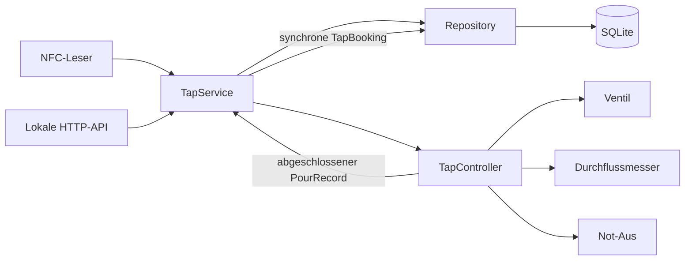

# Backend-Core-Integration

Stand: 2026-07-19

## Ziel

Dieser Alpha-Checkpoint verbindet die bisher getrennten Hardware-,
Zustandsautomaten- und Persistenzschichten zu einem durchgaengigen Ablauf:

1. Eine bekannte aktive NFC-Karte meldet den zugeordneten Benutzer an.
2. Der Start einer manuellen Zapfung oder kompatiblen Portion friert Benutzer,
   Veranstaltung, Fass, Getraenk und Preis
   fuer genau diesen Zapfvorgang ein.
3. Der Zustandsautomat oeffnet das Ventil und wertet die Impulse aus.
4. Der Abschluss erzeugt synchron eine unveraenderliche SQLite-Buchung.
5. Verbrauch, Betrag und rechnerischer Fassbestand sind nach einem Neustart
   weiterhin abrufbar.

Betroffen sind insbesondere `ZZ-AUT-002`, `ZZ-AUT-007` bis `ZZ-AUT-009`,
`ZZ-KEG-004`, `ZZ-TAP-005` bis `ZZ-TAP-010`, `ZZ-MNT-002`, `ZZ-BIL-001` bis
`ZZ-BIL-003`, `ZZ-DAT-001`, `ZZ-DAT-002`, `ZZ-DAT-004`, `ZZ-DAT-005` und
`ZZ-SAF-003` bis `ZZ-SAF-009`.

## Komponentenfluss

`TapController` bleibt die einzige Komponente, die Ventil und Messung steuert.
`TapService` kennt keine GPIOs. Er loest Karten und den aktiven fachlichen
Kontext auf, konvertiert Impulse und nimmt die Buchung entgegen.

Seit M7.9 prüft `TapService` vor jeder Benutzerauflösung die externe
Superadmin-Identität. Eine Übereinstimmung erzeugt den benutzerlosen Zustand
`SUPERADMIN` und niemals eine normale NFC-Sitzung. Die lokale und entfernte
Armbandzuordnung verwenden dieselbe Identität als Reservierung und lehnen sie
vor jedem Datenbankschreibzugriff ab.

## Buchungssnapshot

Beim Start jeder manuellen Zapfung, Portion, Nachfuellung oder Wartungszapfung werden folgende
Werte festgehalten:

- Benutzer-ID,
- aktive Veranstaltung,
- aktives Fass und Getraenk,
- zu diesem Zeitpunkt gueltiger Preis,
- gewaehlte Zielmenge, sofern vorhanden.

Ein paralleler Preis- oder Fasswechsel veraendert diesen bereits begonnenen
Vorgang nicht. Die gemessenen Impulse bleiben die Mengenquelle. Auch Abbruch,
Fehler und Backend-Shutdown buchen ausschliesslich die bis dahin gemessene
Menge.

## Impulsumrechnung

Die Umrechnung arbeitet ohne Gleitkommazahlen. Konfiguriert wird die Anzahl der
Impulse pro Liter ueber `ZUNDER_ZAPFE_PULSES_PER_LITER`. Der Demonstratorwert
ist `500`, entsprechend zwei Millilitern pro Impuls. Dieser Wert ist keine
Kalibrierung oder Genauigkeitszusage fuer den spaeteren realen Sensor.

Zielimpulse werden aufgerundet, damit das Ventil nicht vor Erreichen der
gewaehlten Zielmenge schliesst. Gemessene Impulse werden ganzzahlig auf den
naechsten Milliliter gerundet.

## Sicherheits- und Persistenzfehler

Die Buchung erfolgt synchron aus dem Abschluss des Zustandsautomaten, nachdem
das Ventil geschlossen und die Messung beendet wurde. Kann die Buchung nicht
gespeichert oder keinem gestarteten Kontext zugeordnet werden, wechselt die
Anlage in `FAULT_LOCKED`. Ein Speicherfehler kann dadurch nicht unbemerkt zu
weiteren Zapfungen fuehren.

Eine vom Browser unabhaengige Hintergrundueberwachung verarbeitet NFC-Kanten,
Durchfluss-, Zeit-, Watchdog- und Not-Aus-Zustaende. Neue Karten werden nur beim
Auflegen verarbeitet; eine dauerhaft liegende Karte meldet sich nach einem
Logout nicht sofort erneut an.

Eine verriegelte Sicherheitsstoerung kann ueber die API nur zurueckgesetzt
werden, wenn eine in der Datenbank aktive Admin-Karte tatsaechlich auf dem
NFC-Leser liegt und ein Not-Aus-Kontakt wieder frei ist. Der Client uebergibt
weder Benutzer-ID noch Admin-Flag. Nach dem Reset bleibt die Anlage ohne
Sitzung in `IDLE`; fuer eine Anmeldung muss die Karte erneut aufgelegt werden.

## Lokale API

Die API bietet Sitzung, manuelles Zapfen, kompatible Portion und Nachfuellen, Wartung, Sicherheitsreset,
Verbrauch und Fassstatus fuer die naechsten UI-Schritte. Der vollstaendige
menschlich lesbare Vertrag liegt unter
[`docs/interfaces/http-api.md`](../interfaces/http-api.md), die aus der
Anwendung generierte OpenAPI-Spezifikation unter
[`docs/interfaces/openapi.json`](../interfaces/openapi.json).

Die Verbrauchsroute verwendet ausschliesslich den aktuell am Geraet
angemeldeten Benutzer und akzeptiert keine fremde Benutzer-ID.

## Noch nicht Bestandteil dieses Checkpoints

- fertige Kiosk- und Adminoberflaeche,
- Passwortauthentifizierung fuer Admin-Webfunktionen,
- konfigurierbare Standardportionen und automatischer Logout,
- real kalibrierter Durchflussmesser und reale Ventil-GPIOs,
- Happy Hour, Storno, Export und formale Einzelabrechnung,
- produktiver Bootstrap des initialen Admins.

Der Demo-Seed ist ausschliesslich ein Alpha-Werkzeug und ersetzt den spaeteren
Initial-Admin-Prozess nicht.
