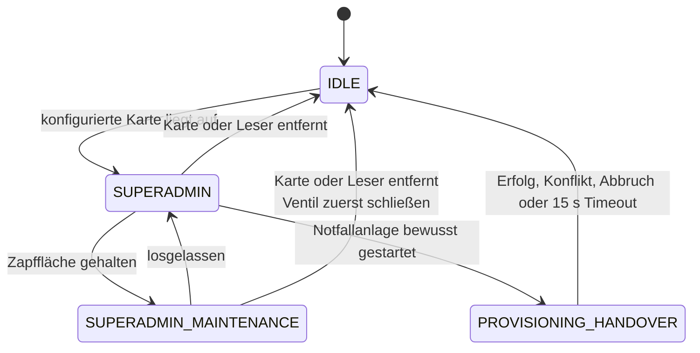

# Externer Superadmin

Stand: 2026-07-24

Diese Architektur setzt [CR-003](../../requirements/changes/CR-003-externer-superadmin.md)
um. Verbindliches Verhalten definieren `ZZ-AUT-013` bis `ZZ-AUT-015`,
`ZZ-UI-007`, `ZZ-UI-010`, `ZZ-NET-003`, `ZZ-MNT-001` und `ZZ-MNT-002`.

## Abgrenzung

Der Superadmin ist weder ein `User` noch eine zusätzliche `UserRole`. Er besitzt
keine Datenbank-ID, kein Webpasswort, keine Websitzung und keine normale
NFC-Kartenzuordnung. Die Smartphone-Verwaltung darf ihn deshalb weder auflisten
noch bearbeiten.

Die lokale Identität wird durch `SuperadminIdentity` geprüft. Ihre
Credential-Datei liegt standardmäßig unter
`/var/lib/zunder-zapfe/superadmin.credential`. Sie enthält einen gesalzenen
Argon2-Hash der kanonischen UID, aber weder Namen noch UID im Klartext. Die
Datei ist lokaler geheimer Laufzeitzustand und muss Modus `0600` besitzen.

Das Einrichtungswerkzeug `zunder-zapfe-superadmin-card`:

- liest die UID ausschließlich vom Hardwareadapter,
- gibt die UID nicht aus,
- nimmt keine UID als Kommandozeilenargument an,
- erstellt die Datei exklusiv,
- überschreibt kein bestehendes Credential,
- prüft vor dem Schreiben die produktive Benutzerdatenbank und lehnt bereits
  zugeordnete Karten ab.

## Laufzeitzustände

Der Zustand `SUPERADMIN` ist seit M7.9 ausführbar. Die dargestellten
Folgezustände für Wartung und Übergabe werden im nächsten Checkpoint ergänzt.

`PROVISIONING_HANDOVER` ist keine Superadmin-Sitzung. Nach Entfernen der
Superadmin-Karte bleibt ausschließlich die einmalige Annahme eines unbekannten
Armbands erlaubt. WLAN, Diagnoseänderungen und Ventilsteuerung sind in diesem
Zustand verboten.

## Autorisierungsvertrag

Jeder Low-Level-Endpunkt benötigt gleichzeitig:

1. einen Loopback-Request,
2. den passenden Backendzustand,
3. eine aktuell vom Hardwareadapter gemeldete Superadmin-Karte.

Ein Browsercookie, eine zuvor geladene Seite oder ein Frontendtimer sind kein
Berechtigungsnachweis. Leserzustand `ready`, `disconnected`, `error` oder eine
andere Karte entziehen die Berechtigung serverseitig.

Die Kartenentfernung wird kurz gegen PC/SC-Aussetzer entprellt. Die bestätigte
Abwesenheit darf zwei Sekunden nicht überschreiten. Bei offenem Ventil besitzt
das Schließen Vorrang vor Navigation, Audit und Persistenz.

## Wartungsentnahme

Die Superadmin-Zapfsteuerung verwendet denselben `TapController`, dieselben
Safety-Limits und dieselbe Durchflussquelle wie normale Zapfungen. Eine
gemessene Entnahme wird als `maintenance`, `chargeable=false` und ohne
Benutzer-/Loginreferenz gespeichert.

Damit gelten gleichzeitig:

- keine Benutzerabrechnung,
- kein persönlicher Verbrauch,
- korrekter Fassbestand,
- unveränderlicher Messdatensatz,
- nachvollziehbarer Abschluss bei Kartenentfernung oder Fehler.

Das dafür notwendige Persistenz- und Auditmodell folgt in M7.9 per
Alembic-Migration als nächster Teil dieses Arbeitspakets. Eine zweite
Ventilsteuerung außerhalb des `TapController` ist unzulässig.

## Notfallanlage

Der Ablauf legt Benutzer, Kartenzuordnung und bei Admins das initiale
Passwort-Credential in einer Datenbanktransaktion an. Ein Konflikt darf keinen
unvollständigen Benutzer hinterlassen.

Automatische Namen verwenden eine fortlaufende, eindeutige Kennung. Normale
Benutzer erhalten kein Passwort. Für Admins wird ein zufälliges Einmalpasswort
erzeugt, nur einmal lokal angezeigt und nicht protokolliert. Der erste
Webzugang erzwingt einen Passwortwechsel.

## Diagnose

Die Diagnose ist standardmäßig lesend. Sie zeigt keine NFC-UIDs,
Credential-Pfade, WLAN-Schlüssel, Passwörter, Sitzungstoken oder Hashes.
Schreibende Aktionen wie WLAN-Wechsel oder Safety-Reset bleiben gesonderte,
auditierte Fachoperationen.

## Implementierungsreihenfolge

1. `M7.8 PLAN/FEAT`: CR-003, externe Identität, lokale Provisionierung.
2. `M7.9 FEAT`: präsenzgebundener Backendzustand und beidseitige
   Kartenkollisionssperre; anschließend actorfähiges Audit und
   Wartungsentnahme ohne Benutzer.
3. `M7.10 UI`: Low-Level-Menü, Admin-Toast, Notfallanlage, Wartung, Diagnose.
4. `M7.11 TEST`: Schnittstellen-, Safety-, Neustart- und Raspberry-Pi-Abnahme.
