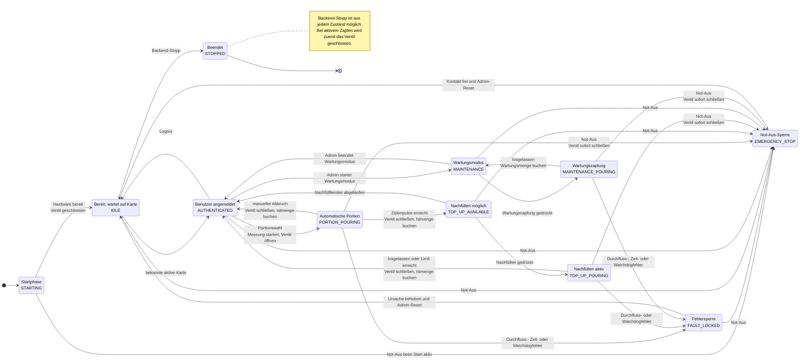

# Zapf-Zustandsautomat

Stand: 2026-07-19

Der Zustandsautomat ist die einzige Backend-Komponente, die Ventil und
Durchflussmessung zu einem Zapfvorgang koordiniert. Die WebUI fordert nur
fachliche Aktionen an; sie schaltet das Ventil nicht direkt.

## Sicherheitsinvarianten

Unabhaengig vom dargestellten Ausgangszustand gelten folgende Regeln:

1. Das Ventil wird vor dem Abschluss einer Messung und vor jedem Zustandswechsel
   aus einem aktiven Zapfvorgang geschlossen.
2. Not-Aus, fehlende Durchflussimpulse, Zeitueberschreitungen und ein
   abgelaufener Steuerungs-Watchdog schliessen das Ventil. Eine vom WebUI-Thread
   unabhaengige Hintergrundueberwachung wertet diese Bedingungen zyklisch aus.
3. `EMERGENCY_STOP` und `FAULT_LOCKED` bleiben verriegelt. Das Beheben der
   Ursache allein reicht nicht; fuer den Reset muss eine aktive Admin-Karte
   tatsaechlich auf dem NFC-Leser liegen. Danach startet keine Sitzung
   automatisch.
4. Weitere Kartenereignisse veraendern einen laufenden Zapfvorgang nicht.
5. Buchungen verwenden die gemessenen Impulse, auch bei Abbruch und Fehler.
6. Wartungszapfungen werden gemessen, aber als nicht kostenpflichtig markiert.

## Integration und verbleibende Grenzen

`TapService` ordnet NFC-UIDs aktiven Benutzern zu und speichert die vom
Zustandsautomaten abgeschlossenen `PourRecord`-Objekte als unveraenderliche
Zapfbuchungen. Der aktive Veranstaltungs-, Fass-, Getraenke- und Preiskontext
wird dazu beim Zapfstart festgehalten. Der vollstaendige Fluss ist unter
[`backend-core-integration.md`](backend-core-integration.md) beschrieben.

Die in `development_limits()` enthaltenen Werte und die Demonstrator-Kalibrierung
sind weiterhin keine Produktionswerte. Verbindliche Werte bleiben offene
Produktentscheidungen `OD-002` und `OD-003`; reale Ventil- und
Durchfluss-Hardware sind noch nicht integriert.

## Traceability

Der aktuelle Stand deckt die Struktur und simulatorischen Tests fuer
`ZZ-AUT-008` bis `ZZ-AUT-010`, `ZZ-TAP-005` bis `ZZ-TAP-010`, `ZZ-HW-003` bis
`ZZ-HW-005`, `ZZ-SAF-003` bis `ZZ-SAF-009`, `ZZ-MNT-001`, `ZZ-MNT-002`,
`ZZ-NFR-001` und `ZZ-NFR-002` ab. Persistenz und NFC-Benutzerzuordnung sind nun
simulatorisch integriert. Eine Anforderung gilt erst nach Integration der noch
fehlenden Benutzeroberflaechen und realen Zapfhardware als vollstaendig
umgesetzt.
