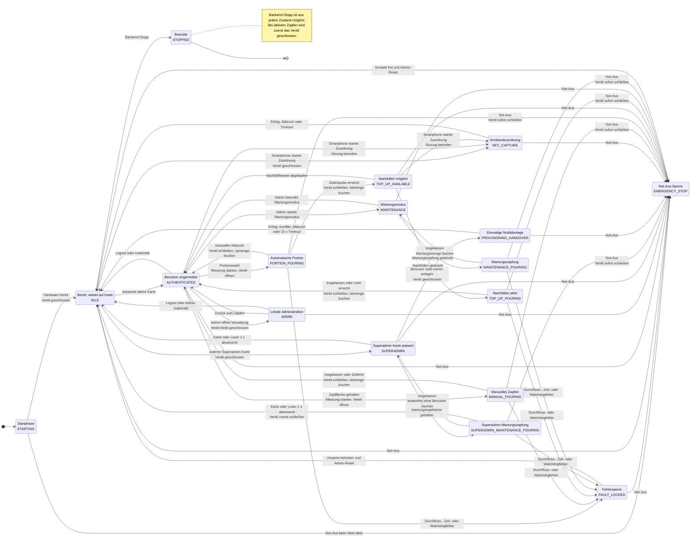

# Zapf-Zustandsautomat

Stand: 2026-07-24

Der Zustandsautomat ist die einzige Backend-Komponente, die Ventil und
Durchflussmessung zu einem Zapfvorgang koordiniert. Die WebUI fordert nur
fachliche Aktionen an; sie schaltet das Ventil nicht direkt.

## Übergangstabelle

Die Tabelle ergänzt das Diagramm in einer für Reviews und Entwicklungsagenten
eindeutigeren Form. `Safety-Fehler` umfasst je nach Zapfart Not-Aus,
Durchfluss-, Zeit- und Watchdoggrenzen.

| Ausgang | Ereignis/Aktion | Guard | Ziel | Wesentliche Wirkung |
| --- | --- | --- | --- | --- |
| `STARTING` | `start` | Not-Aus frei | `IDLE` | Ventil schließen, Hardware bereit |
| `STARTING` | `start` | Not-Aus aktiv | `EMERGENCY_STOP` | Ventil schließen, Grund speichern |
| `IDLE` | bekannte aktive Karte | Benutzer aktiv | `AUTHENTICATED` | Sitzung aufbauen |
| `IDLE` | konfigurierte Superadmin-Karte | externe Identität stimmt | `SUPERADMIN` | keine Benutzersitzung; Ventil geschlossen halten |
| `SUPERADMIN` | Karte oder Leser bestätigt abwesend | 1 s Entprellung | `IDLE` | lokale Berechtigung vollständig löschen |
| `SUPERADMIN` | `start_superadmin_maintenance_pour` | Karte physisch präsent, aktiver Fasskontext | `SUPERADMIN_MAINTENANCE_POURING` | Messung nullen, Ventil öffnen |
| `SUPERADMIN_MAINTENANCE_POURING` | `stop_superadmin_maintenance_pour` | Karte physisch präsent | `SUPERADMIN` | Ventil schließen, kostenfrei ohne Benutzer-/Loginreferenz buchen |
| `SUPERADMIN_MAINTENANCE_POURING` | Karte oder Leser bestätigt abwesend | 1 s Entprellung | `IDLE` | Ventil zuerst schließen, Abschluss `card_removed` speichern, Berechtigung löschen |
| `SUPERADMIN` | `begin_provisioning_handover` | Karte physisch präsent, Rolle `user` oder `admin` | `PROVISIONING_HANDOVER` | Ventil schließen und ausschließlich eine einmalige NFC-Erfassung freigeben |
| `PROVISIONING_HANDOVER` | unbekannte Karte, Konflikt, Abbruch oder 15-s-Timeout | Leser wurde zuvor leer beobachtet | `IDLE` | Ventil geschlossen halten und normale Anmeldung bis zur Kartenentfernung unterdrücken |
| `AUTHENTICATED` | `logout` oder Inaktivitätszeit | – | `IDLE` | Sitzung löschen |
| `AUTHENTICATED` | Touchaktivität | – | `AUTHENTICATED` | Inaktivitätszeit zurücksetzen |
| `AUTHENTICATED` | `enter_admin_mode` | Admin | `ADMIN` | Ventil schließen, Admin-Timeout starten |
| `ADMIN` | Touchaktivität | – | `ADMIN` | Admin-Inaktivitätszeit zurücksetzen |
| `ADMIN` | `exit_admin_mode` | – | `AUTHENTICATED` | normalen Timeout neu starten |
| `ADMIN` | `logout` oder Admin-Inaktivitätszeit | – | `IDLE` | Sitzung vollständig löschen |
| `IDLE`, `AUTHENTICATED` oder `TOP_UP_AVAILABLE` | `begin_nfc_capture` | kein aktiver Zapfvorgang oder Safety-Lock | `NFC_CAPTURE` | Ventil schließen, Sitzung und Nachfüllfenster löschen |
| `NFC_CAPTURE` | Erfolg, Abbruch oder Timeout | – | `IDLE` | Ventil geschlossen halten, NFC-Anmeldung wieder freigeben |
| `AUTHENTICATED` | `start_manual_pour` | aktiver Fachkontext | `MANUAL_POURING` | Messung nullen, Ventil öffnen |
| `MANUAL_POURING` | `stop_manual_pour` | – | `AUTHENTICATED` | Ventil schließen, Istmenge buchen |
| `MANUAL_POURING` | maximales Zeitlimit | – | `AUTHENTICATED` | Ventil schließen, Istmenge mit Limitabschluss buchen |
| `AUTHENTICATED` | `start_portion` | Ziel > 0, aktiver Fachkontext | `PORTION_POURING` | Messung nullen, Ventil öffnen |
| `PORTION_POURING` | Zielimpulse erreicht | – | `TOP_UP_AVAILABLE` | Ventil schließen, Istmenge buchen |
| `PORTION_POURING` | `abort_portion` | – | `AUTHENTICATED` | Ventil schließen, Istmenge buchen |
| `TOP_UP_AVAILABLE` | `start_top_up` | Zeitfenster aktiv | `TOP_UP_POURING` | neue Messung, Ventil öffnen |
| `TOP_UP_AVAILABLE` | Zeitfenster abgelaufen | – | `AUTHENTICATED` | Nachfüllen verwerfen |
| `TOP_UP_AVAILABLE` | `logout` | – | `IDLE` | Sitzung löschen |
| `TOP_UP_POURING` | `stop_top_up` | – | `AUTHENTICATED` | Ventil schließen, Istmenge buchen |
| `TOP_UP_POURING` | Zeit-/Impulslimit | – | `AUTHENTICATED` | Ventil schließen, Istmenge buchen |
| `AUTHENTICATED` | `enter_maintenance` | Admin | `MAINTENANCE` | Wartungsmodus aktivieren |
| `MAINTENANCE` | `start_maintenance_pour` | – | `MAINTENANCE_POURING` | Messung nullen, Ventil öffnen |
| `MAINTENANCE_POURING` | `stop_maintenance_pour` | – | `MAINTENANCE` | Ventil schließen, kostenfrei buchen |
| `MAINTENANCE` | `exit_maintenance` | – | `AUTHENTICATED` | Wartungsmodus verlassen |
| aktiver Zapfzustand | Safety-Fehler | kein aktiver Not-Aus | `FAULT_LOCKED` | Ventil schließen, Fehlerabschluss buchen |
| beliebiger Betriebszustand | Not-Aus erkannt | – | `EMERGENCY_STOP` | Ventil sofort schließen, verriegeln |
| `FAULT_LOCKED` | `reset_safety_lock` | aktive Admin-Karte, Not-Aus frei | `IDLE` | Grund löschen, keine Sitzung starten |
| `EMERGENCY_STOP` | `reset_safety_lock` | aktive Admin-Karte, Not-Aus frei | `IDLE` | Grund löschen, keine Sitzung starten |
| beliebiger Zustand | `shutdown` | – | `STOPPED` | zuerst Ventil schließen; aktiven Vorgang abschließen |

Nicht aufgeführte Aktionen sind ungültig und führen zu `409`, nicht zu einem
impliziten Zustandswechsel. Eine zweite NFC-Karte verändert einen aktiven
Zapfvorgang nicht.

## Sicherheitsinvarianten

Unabhaengig vom dargestellten Ausgangszustand gelten folgende Regeln:

1. Das Ventil wird vor dem Abschluss einer Messung und vor jedem Zustandswechsel
   aus einem aktiven Zapfvorgang geschlossen.
2. Not-Aus, fehlende Durchflussimpulse, Zeitueberschreitungen und ein
   abgelaufener Steuerungs-Watchdog schliessen das Ventil. Eine vom WebUI-Thread
   unabhaengige Hintergrundueberwachung wertet diese Bedingungen zyklisch aus.
3. `EMERGENCY_STOP` und `FAULT_LOCKED` bleiben verriegelt. Das Beheben der
   Ursache allein reicht nicht; fuer den Reset muss eine aktive Admin-Karte
   tatsaechlich auf dem NFC-Leser liegen. Danach startet keine Sitzung
   automatisch.
4. Weitere Kartenereignisse veraendern einen laufenden Zapfvorgang nicht.
5. Buchungen verwenden die gemessenen Impulse, auch bei Abbruch und Fehler.
6. Wartungszapfungen werden gemessen, aber als nicht kostenpflichtig markiert.
7. Das Zeitlimit manueller Zapfungen beendet den Vorgang kontrolliert. Fehler
   bei Durchfluss, Watchdog oder Not-Aus bleiben verriegelnde Safety-Ereignisse.
8. `NFC_CAPTURE` öffnet niemals das Ventil. Kartenereignisse werden in diesem
   Zustand ausschließlich für die kurzlebige Adminzuordnung verarbeitet und
   starten keine Kiosksitzung. Sein Ende hebt keinen Safety-Lock auf.
9. `SUPERADMIN` besitzt weder Benutzer-ID noch normale Adminsitzung. Eine
   gleichlautende UID in der Benutzerdatenbank wird nicht zur Anmeldung
   verwendet. Ausschließlich `SUPERADMIN_MAINTENANCE_POURING` darf das Ventil
   öffnen; dabei bleiben alle Safety-Grenzen aktiv.
10. `PROVISIONING_HANDOVER` öffnet niemals das Ventil und erlaubt weder WLAN-
    noch Diagnose- oder Wartungsaktionen. Das erste unbekannte Armband wird nur
    durch den Notfall-Anlagedienst verarbeitet und startet keine Kiosksitzung.

## Integration und verbleibende Grenzen

`TapService` ordnet NFC-UIDs aktiven Benutzern zu und speichert die vom
Zustandsautomaten abgeschlossenen `PourRecord`-Objekte als unveraenderliche
Zapfbuchungen. Der aktive Veranstaltungs-, Fass-, Getraenke- und Preiskontext
wird dazu beim Zapfstart festgehalten. Der vollstaendige Fluss ist unter
[`backend-core-integration.md`](backend-core-integration.md) beschrieben.

Vor der Benutzerauflösung prüft `TapService` die externe
`SuperadminIdentity`. Bei Übereinstimmung entsteht ausschließlich
`SUPERADMIN`. `AdminService` weist dieselbe Karte bei lokaler und entfernter
Live-Zuordnung ab. Die bestätigte Kartenabwesenheit wird im unabhängigen
Backendzyklus ausgewertet und benötigt keinen Browserrequest.

Die in `development_limits()` enthaltenen Werte und die Demonstrator-Kalibrierung
sind weiterhin keine Produktionswerte. Verbindliche Werte bleiben offene
Produktentscheidungen `OD-002`, `OD-003` und `OD-012`; reale Ventil- und
Durchfluss-Hardware sind noch nicht integriert.

Für die normale Kiosksitzung gelten `15` Sekunden Inaktivität als
konfigurierbarer Alpha-Default. Im Zustand `ADMIN` gilt separat ein auditiert
einstellbarer Default von `30` Sekunden. Die gesamte verbleibende Zeit zeigt
die WebUI als Balken; Touch setzt den jeweils aktiven Timer zurück. Eine aktive
Zapfung oder das Nachfüllfenster werden nicht durch den Sitzungstimer beendet.

## Traceability

Der aktuelle Stand deckt die Struktur und simulatorischen Tests fuer
`ZZ-AUT-008` bis `ZZ-AUT-010`, `ZZ-AUT-013`, `ZZ-AUT-014`, `ZZ-TAP-008`,
`ZZ-TAP-013`, `ZZ-TAP-014`, `ZZ-HW-003` bis `ZZ-HW-005`, `ZZ-SAF-003` bis
`ZZ-SAF-009`, `ZZ-MNT-001`, `ZZ-MNT-002`, `ZZ-NFR-001` und `ZZ-NFR-002` ab.
Persistenz und NFC-Benutzerzuordnung sind simulatorisch integriert. Eine
Anforderung gilt erst nach Integration der noch fehlenden Benutzeroberflächen
und realen Zapfhardware als vollständig umgesetzt.
